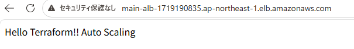
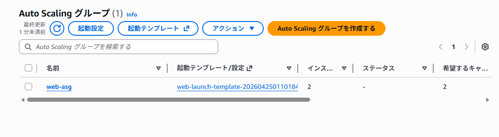

# 📘 Terraform AWS 2層構成ポートフォリオ

## 📌 概要
Terraformを使用して、AWS上に実務を意識した2層構成のインフラを構築しました。

本ポートフォリオでは、セキュリティを意識し、EC2をPrivate Subnetに配置し、ALB経由でのみアクセス可能な構成を実装しています。  
Terraformによるインフラ管理（IaC）の理解を目的としています。

- VPC
- Public Subnet
- Private Subnet
- Internet Gateway
- NAT Gateway
- Route Table
- Security Group
- EC2（Private）
- ALB（Application Load Balancer）

---

## 🏗️ 構成

Internet  
↓  
ALB（Application Load Balancer）  
↓  
EC2（Private Subnet）  
↓  
NAT Gateway（外向き通信）  

---

## 🚀 実施内容

- TerraformでAWS環境を構築
- Public / Private Subnet構成を実装
- NAT Gatewayによる外向き通信の実現
- ALBを用いた負荷分散構成の実装
- Security Groupによる通信制御
- terraform plan による差分確認
- terraform apply によるリソース作成
- terraform destroy による環境削除まで実施

---

## ⚠️ 苦労した点

### 1. セキュリティグループの設定ミス

ALB用とEC2用のSecurity Group設定でエラーが発生しました。

発生したエラー  
Self-referential block  

原因  
ALBのSecurity Group内で自身を参照してしまっていた  

対応  
ALB用とEC2用で役割を分離し、EC2側でALBからの通信のみ許可するよう修正  

---

### 2. Terraformコマンドが動かなかった

Terraform実行時に、コマンドが認識されない問題が発生しました。

発生したエラー  
terraform は認識されていません  

原因  
terraform.exe があるフォルダ以外で実行していたため  

対応  
実行ディレクトリを見直し、terraform.exe があるフォルダで実行して解決  

---

### 3. EC2にアクセスできなくなった

Private Subnetへ移行後、ブラウザからEC2へアクセスできなくなりました。

原因  
EC2がPublicではなくPrivate Subnetに配置されたため  

対応  
ALBを導入し、外部アクセスはALB経由のみとする構成に変更  

---

## 📚 学んだこと

- TerraformはコードでAWSリソースを管理できる
- Public / Private Subnetの役割の違い
- NAT GatewayはPrivate Subnetの外向き通信に必要
- ALBによりセキュアに公開できる
- Security Groupは設計が重要
- エラーは原因を分解すると解決できる

---

## 🎯 今後の課題

- Auto Scalingの導入
- RDS（データベース）の追加
- Route53による独自ドメイン対応
- HTTPS化（ACM + ALB）

---

## 🛠️ 使用技術

- Terraform
- AWS
  - VPC
  - Subnet（Public / Private）
  - Internet Gateway
  - NAT Gateway
  - Route Table
  - Security Group
  - EC2
  - ALB

---

## 🌐 Webサーバー動作確認

ALBのDNSにアクセスすることで、Private Subnet上のEC2に接続されます。

Hello Terraform!!

Terraformの user_data を使用し、EC2起動時にWebサーバーのインストール・起動・HTML配置まで自動化しています。

※現在は停止しています

---

## 🙌 補足

AWS学習の一環として作成したポートフォリオです。  
実務レベルの構成を意識しながら、継続的に改善しています。

## 📷 動作確認

## 📷 Auto Scaling

