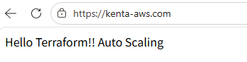
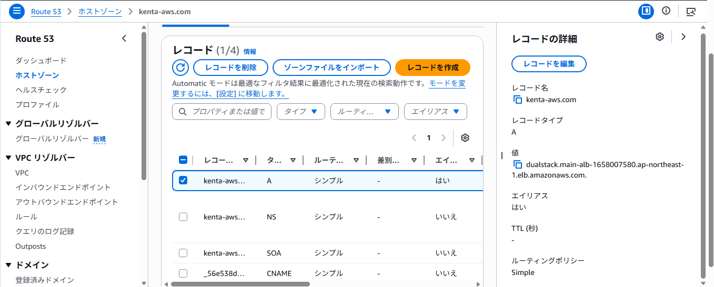
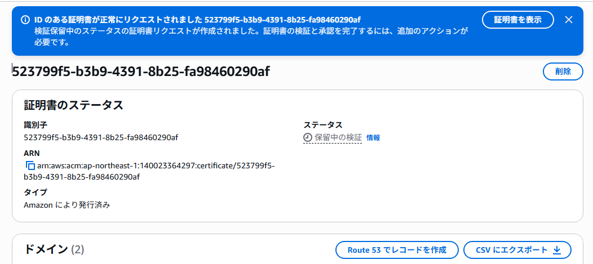
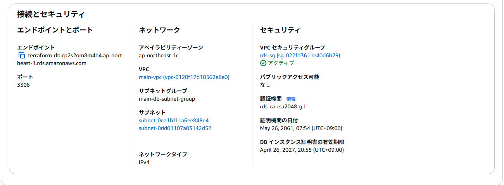

# 📘 Terraform AWS 2層構成ポートフォリオ（Auto Scaling + HTTPS対応）

## 📌 概要
Terraformを使用して、AWS上に実務を意識した2層構成のインフラを構築しました。

EC2をPrivate Subnetに配置し、ALB経由でのみアクセス可能とすることでセキュリティを確保しています。  
さらにAuto Scalingを導入し、負荷に応じたスケーラビリティを実現しました。

また、RDS（MySQL）をPrivate Subnetに配置し、EC2からのみ接続可能な構成とすることで、データベースのセキュリティも考慮しています。

Terraformによるインフラ管理（IaC）の理解を目的としています。

---

## 🌐 公開URL

https://kenta-aws.com

独自ドメインを取得し、Route53でDNS管理を行い、ACMでSSL証明書を発行。  
ALBにHTTPSリスナーを設定し、HTTPからHTTPSへのリダイレクトを実装しています。

---

## 🏗️ 構成

- VPC
- Public Subnet
- Private Subnet（2AZ）
- Internet Gateway
- NAT Gateway
- Route Table
- Security Group
- ALB（Application Load Balancer）
- Auto Scaling Group
- EC2（自動生成）

※EC2からの外向き通信はNAT Gateway経由で実施

---

## 🧠 設計意図

外部公開はALBのみに限定し、EC2はPrivate Subnetに配置することで、  
セキュリティと可用性を意識した構成としました。

また、Auto Scalingを導入することで、負荷に応じたスケールを実現しています。

---

## 🚀 実施内容

- TerraformでAWS環境を構築
- Public / Private Subnet構成を実装
- NAT Gatewayによる外向き通信の実現
- ALBを用いた負荷分散構成の実装
- Auto ScalingによるEC2の自動スケーリング
- Security Groupによる通信制御
- terraform plan による差分確認
- terraform apply によるリソース作成
- terraform destroy による環境削除まで実施
- RDS（MySQL）の構築
- EC2からRDSへの接続を考慮したセキュリティ設計
- ACMによるSSL証明書発行
- ALBによるHTTPS通信の実装
- Route53による独自ドメイン設定

---

## 💡 工夫した点

- EC2をPrivate Subnetに配置し、直接インターネットからアクセスできない構成とした
- ALB経由のみアクセス可能とし、セキュリティを強化
- HTTPS通信を実装し、実務に近い公開構成を再現
- Terraformによりインフラの再現性と管理性を向上

---

## ⚠️ 苦労した点

### 1. セキュリティグループの設定ミス

発生したエラー  
Self-referential block  

原因  
Security Group内で自身を参照してしまった  

対応  
ALB用とEC2用で役割を分離し、EC2はALBからの通信のみ許可するよう修正  

---

### 2. Terraformコマンドが動かなかった

発生したエラー  
terraform は認識されていません  

原因  
terraform.exe があるフォルダ以外で実行していた  

対応  
実行ディレクトリを見直し、terraform.exe があるフォルダで実行して解決  

---

### 3. Auto Scaling移行時のエラー

発生したエラー  
Reference to undeclared resource  

原因  
aws_instance を削除後、outputs.tf に参照が残っていた  

対応  
不要なoutputを削除して解決  

---

## 📚 学んだこと

- TerraformはコードでAWSリソースを管理できる
- Public / Private Subnetの役割の違い
- NAT Gatewayは外向き通信に必要
- ALBにより安全に公開できる
- Auto Scalingにより可用性とスケーラビリティを確保できる
- Security Group設計の重要性
- HTTPS通信の重要性と実装方法（ACM + ALB）
- DNS（Route53）の仕組み

---

## 🎯 今後の課題

- CloudFrontによるCDN構成
- WAFによるセキュリティ強化
- CI/CD（GitHub Actions）による自動デプロイ

---

## 🛠️ 使用技術

- Terraform
- AWS
  - VPC
  - Subnet（Public / Private）
  - Internet Gateway
  - NAT Gateway
  - Route Table
  - Security Group
  - EC2
  - ALB
  - Auto Scaling
  - RDS（MySQL）
  - Route53
  - ACM

---

## 🌐 Webサーバー動作確認

https://kenta-aws.com

ALB経由でAuto Scalingによって起動したEC2にアクセスできます。

Hello Terraform!! Auto Scaling

Terraformの user_data を使用し、EC2起動時にWebサーバーのインストール・起動・HTML配置まで自動化しています。

※現在は停止しています

---

## 📷 動作確認

## 📷 Route53

## 📷 ACM

## 📷 ALB

## 📷 Auto Scaling

## 📷 RDS

---

## 🙌 補足

AWS学習の一環として作成したポートフォリオです。  
実務レベルの構成を意識しながら、継続的に改善しています。
